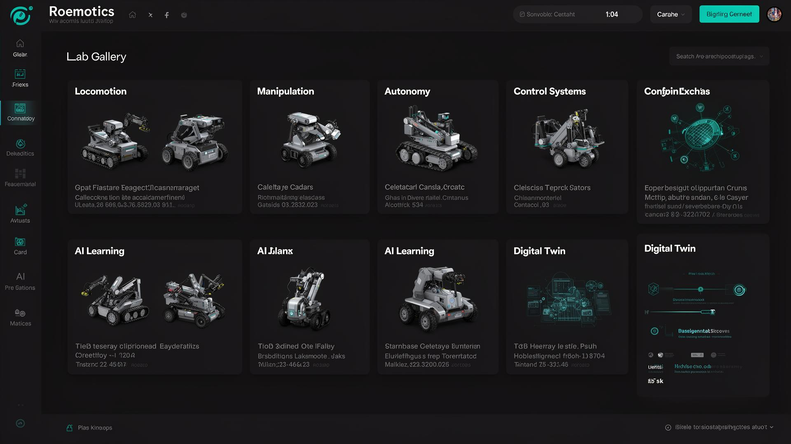
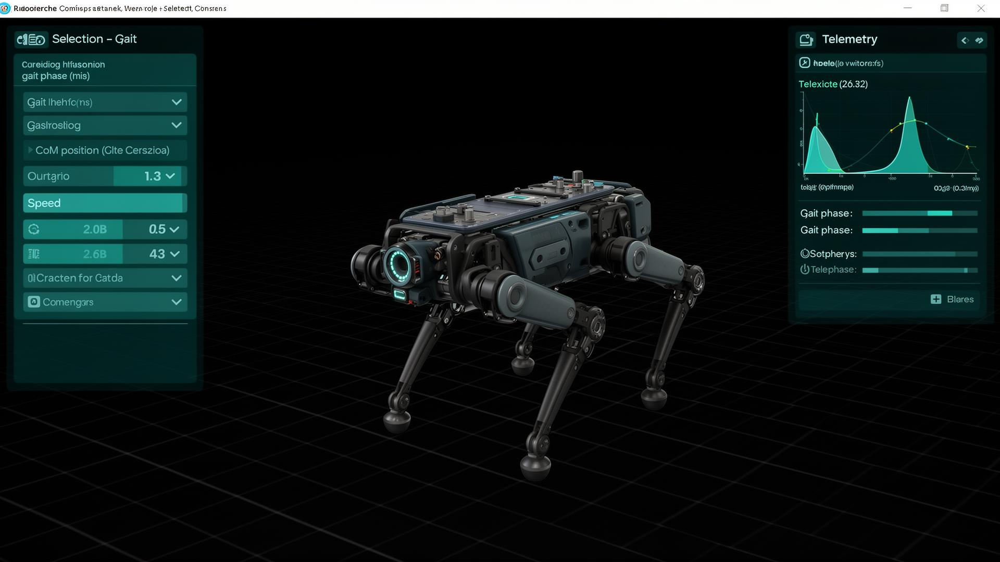
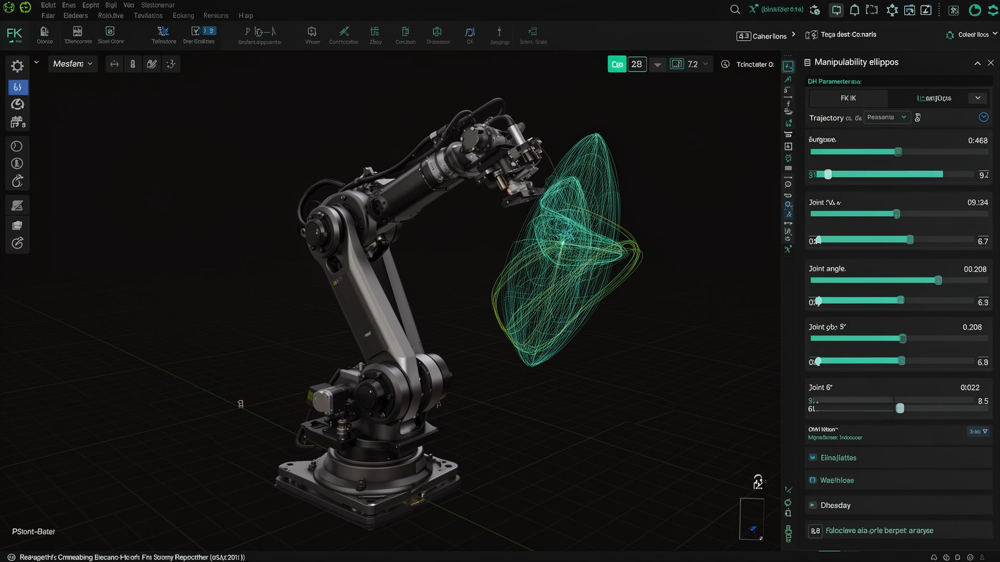
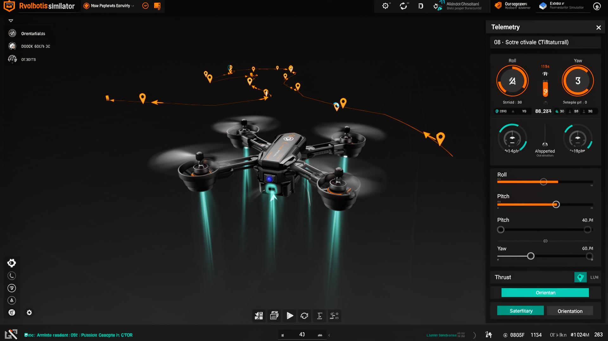
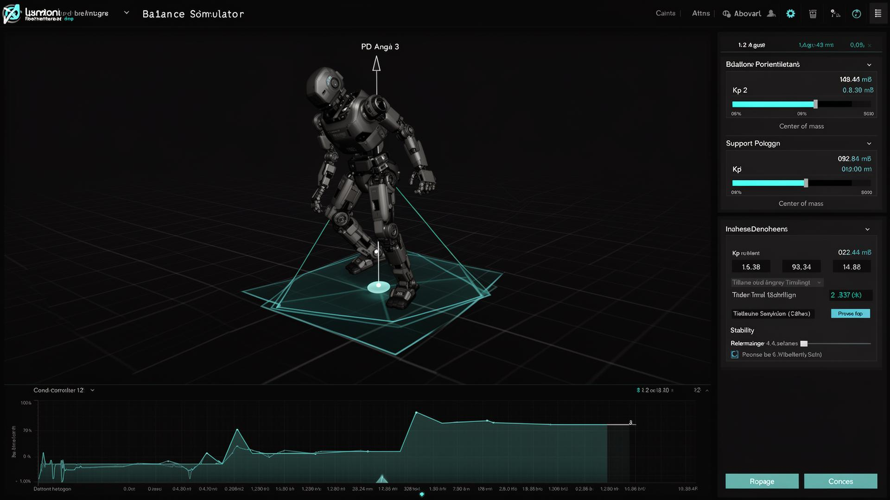
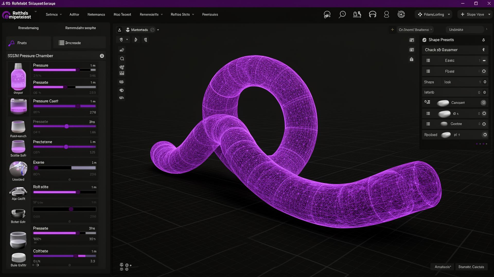

# RoboSimLab

**Professional-grade multi-robot interactive simulation and education platform running entirely in the browser.**

Built with React, Three.js, TypeScript, and Tailwind CSS. Designed to Apple Human Interface standards with Boston Dynamics-style engineering visualization.


---

## 🖼️ Screenshots

### Gallery — 6 Lab Categories, 29 Modules
> The home page organizes all simulators into Locomotion, Manipulation, Autonomy, Control, AI, and Digital Twin labs.



### Quadruped Robot — Walking Gaits & CoM
> Four-legged robot with walk/trot gait switching, center of mass tracking, support polygon, and disturbance recovery.



### Robotic Arm — FK/IK with Jacobian Analysis
> 3-DOF articulated arm with forward/inverse kinematics, manipulability ellipsoid, DH parameters, and trajectory trail.



### Drone Simulator — Attitude & Waypoint Control
> Quadcopter with manual thrust/roll/pitch/yaw control and autonomous waypoint navigation with trajectory visualization.



### Humanoid Balance — PD Control & Push Recovery
> 3D humanoid with inverted pendulum dynamics, telemetry showing STABLE/UNSTABLE status, and real-time torque charts.



### Soft Robot — Pneumatic Deformable Body
> Soft pneumatic robot with 3-chamber pressure control, shape presets, wireframe overlay, and continuum mechanics.



---

## 🚀 Quick Start

```bash
npm install
npm run dev
```

Open `http://localhost:5173` — that's it.

| Command | Description |
|---------|-------------|
| `npm run dev` | Start dev server with HMR |
| `npm run build` | Production build to `dist/` |
| `npm run preview` | Preview production build |
| `npm run test` | Run test suite |
| `npm run lint` | Lint with ESLint |

---

## 🧪 Simulation Labs (6 Labs · 29 Modules)

### 🦿 Locomotion Lab
| Module | Description |
|--------|-------------|
| **Quadruped Robot** 🆕 | Walking & trotting gaits, CoM stabilization, support polygon, footstep planning |
| **Humanoid Balance** | 3D inverted pendulum with PD control, CoM tracking, cinematic camera |
| **Swarm Robotics** | 300-agent 3D boids with flocking dynamics |

### 🦾 Manipulation Lab
| Module | Description |
|--------|-------------|
| **Robotic Arm Kinematics** | FK/IK, Jacobian, manipulability ellipsoid, DH params, trajectory trail |
| **Soft Robot Lab** 🆕 | Pneumatic chamber control, deformable body, continuum mechanics |
| **Robot Dynamics & Torque** | Joint torque/velocity/energy charts, velocity vectors, coordinate frames |
| **Trajectory Optimization** | Start/goal poses, cost minimization, collision avoidance |
| **Differentiable Robotics** | Real-time Jacobian, singularity detection, manipulability ellipsoids |
| **Custom Robot Builder** | 1–7 DOF manipulators, configurable links, JSON export |

### 🚁 Autonomy Lab
| Module | Description |
|--------|-------------|
| **Drone Simulator** 🆕 | Quadcopter attitude control, thrust vectors, waypoint navigation |
| **Autonomous Navigation** | Waypoint following, obstacle avoidance, SLAM mapping |
| **SLAM Exploration** | Frontier-based autonomous mapping with BFS pathfinding |
| **SLAM Visualization** | Autonomous exploration with laser scanning, occupancy grid |
| **Sensor & Perception Lab** | Lidar raycasting, depth profiles, camera FOV |
| **Sensor Fusion Lab** | Lidar + Camera + IMU unified perception with confidence heatmap |
| **Robot Teleoperation** | WASD keyboard control with lidar, minimap, collision HUD |

### ⚙️ Control Systems
| Module | Description |
|--------|-------------|
| **PID Control Lab** | Tunable P/I/D gains, real-time response curves, CSV export |
| **Motion Planning Studio** | A*, Dijkstra, RRT, PRM, Potential Field — step-by-step visualization |
| **Algorithm Comparison** | Side-by-side pathfinding analysis |
| **Control Architecture** | Visual sensor→perception→planning→control→actuator pipeline |
| **Multi-Agent Coordination** | Nearest-first & priority auction task allocation |

### 🧠 AI & Learning
| Module | Description |
|--------|-------------|
| **RL Playground** | Q-learning grid world, policy visualization, reward curves |
| **Multi-Agent RL** | Cooperative Q-learning with shared Q-tables |
| **RL Policy Introspection** | Policy entropy, state visitation heatmap, success rate dashboard |
| **Neural Policy Brain** | Neural network visualization with activations and signal flow |
| **Sim-to-Real Gap** | Ideal vs noisy trajectory comparison with configurable noise/delay |

### 🏗️ Digital Twin Lab
| Module | Description |
|--------|-------------|
| **Digital Twin Builder** | Modular robot assembly with links, joints, sensors |
| **Digital Twin Dashboard** | Real-time monitoring of torques, velocities, energy |
| **Robot Task Designer** | Custom task design with goals, obstacles, reward fields |

---

## 🤖 Robot Types

| Robot | Lab | Key Concepts |
|-------|-----|-------------|
| **Quadruped** | Locomotion | Gaits, CoM, support polygon, disturbance recovery |
| **Humanoid** | Locomotion | Inverted pendulum, PD control, ZMP |
| **Robotic Arm** | Manipulation | FK/IK, Jacobian, DH parameters, workspace |
| **Soft Robot** | Manipulation | Pneumatic actuation, continuum mechanics, deformation |
| **Drone** | Autonomy | Attitude control, thrust vectors, waypoint nav |
| **Mobile Robot** | Autonomy | SLAM, path planning, obstacle avoidance |
| **Swarm** | Locomotion | Boids, flocking, formation control |

---

## 🎓 Learning Mode

Every simulation module includes a **Learning Mode** toggle that transforms the simulator into an educational robotics lab:

- **Education Panels** — Concept explanations, formulas, key points, and practical tips
- **3D Tooltip Hotspots** — Hover over joints, sensors, and actuators for inline explanations
- **Contextual Hints** — Interactive tooltips that appear during specific interactions
- **Focus Mode** — Cinematic robot inspection with subsystem labels
- **Context-Aware Telemetry** — Panels adapt to show mode-specific data (walking → step frequency, balancing → torque)

---

## 🏗️ Architecture

```
src/
├── components/
│   ├── 3d/                # Three.js models (RobotArm3D, Humanoid3D, Quadruped3D, Drone3D, SoftRobot3D)
│   ├── ui/                # shadcn/ui component library
│   ├── SimLayout.tsx      # Shared layout with Learning Mode context
│   ├── FocusMode.tsx      # Cinematic inspection overlay
│   ├── TelemetryPanel.tsx # Context-aware telemetry display
│   ├── EducationPanel.tsx # Educational content panel + ContextHint
│   ├── ControlSection.tsx # Collapsible control panel
│   ├── SliderControl.tsx  # Apple-style parameter slider
│   └── DataExport.tsx     # CSV export utility
├── pages/                 # 29 simulation module pages
├── hooks/                 # Custom React hooks
├── lib/                   # Utilities
└── index.css              # Design system tokens
```

---

## 🛠️ Tech Stack

| Technology | Purpose |
|-----------|---------|
| **React 18** | UI framework |
| **TypeScript** | Type safety |
| **Three.js / R3F** | 3D rendering |
| **Tailwind CSS** | Styling & design tokens |
| **Vite** | Build tooling |
| **Vitest** | Testing |
| **shadcn/ui** | Component library |
| **Zustand** | State management |
| **Recharts** | Data visualization |

---

## 📦 Deployment

### Vercel (Recommended)
The project is a standard Vite SPA — deploy directly to Vercel:
1. Connect your GitHub repo to Vercel
2. Build command: `npm run build`
3. Output directory: `dist`
4. Framework preset: Vite

All routes use client-side routing (`react-router-dom`), so Vercel's default SPA rewrites handle fallback automatically.

### Docker

```bash
docker build -t robosimlab .
docker run -d -p 8080:80 robosimlab
```

The Dockerfile uses a multi-stage build (Node 20 → Nginx Alpine) with SPA fallback routing configured.

### Guides
| Guide | Description |
|-------|-------------|
| [🐳 Docker](./docs/docker.md) | Multi-stage builds, Docker Compose, Nginx config |
| [☸️ Kubernetes](./docs/kubernetes.md) | Deployment, Service, Ingress, HPA, TLS |
| [⚙️ CI/CD](./docs/ci-cd.md) | GitHub Actions — lint, test, build, Docker push |
| [🏗️ Architecture](./docs/architecture.md) | Simulation engine, kinematics, control systems |

---

## 🔄 CI/CD

GitHub Actions run automatically on push:

| Workflow | Description |
|----------|-------------|
| **CI** (`ci.yml`) | Lint → Type Check → Test → Build |
| **Docker** (`docker.yml`) | Build & push image to GHCR on main/tags |

---

## 📋 Roadmap

See [roadmap.md](./roadmap.md) for detailed phase-by-phase progress tracking (11 phases, all complete).

**Current status:** v6.0 — 29 modules across 6 labs, all operational.

---

## 📄 License

MIT License. See [LICENSE](./LICENSE) for details.
